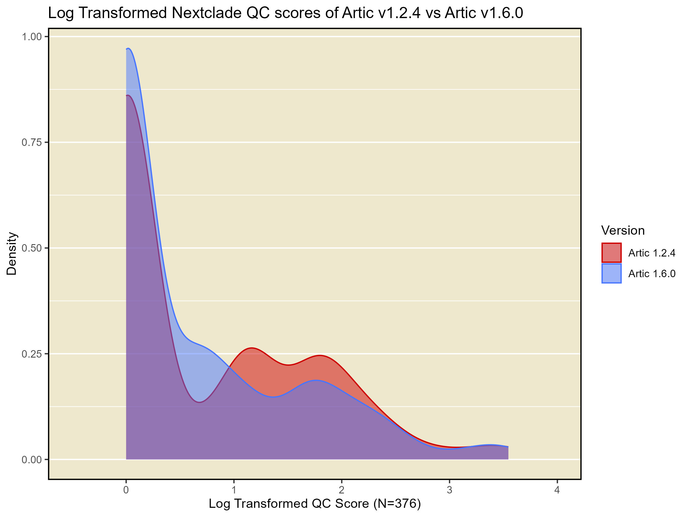

# Artic Update Testing
Update from artic `1.2.4` to `1.6.0` which changes to using `clair3` from `medaka` and `nanopolish` along with updating the nextclade version from `3.3.1` to `3.9.1`

Date: Feb 25th, 2025

Author: Amber Papineau

---------------

### Update Summary
#### Updates to Artic
1.2 to 1.5 major [changes](https://github.com/nextstrain/nextclade/releases?page=2):
* rapid barcoded (fragmented) primer trimming and normalisation
* Nanopolish has been removed completely due to several compatibility issues
* Medaka has also been removed completely due to kicking out long indels
* Clair3 is now the default variant caller
	* by default only the r9.4.1 models are available but a `artic_get_models` command has been added which will fetch the ONT created r10.4.1 models listed in the [rerio](https://github.com/nanoporetech/rerio) repository.
	* The pipeline will also attempt to pick an appropriate model based on the `basecall_model_version_id` field that is added to read headers by default by ONT sequencers.
* Removed longshot entirely, 
	* it also kicks out long variants and is now unnecessary due to clair3 being a much better variant caller.
* Primer scheme fetcher has been updated to pull from the [quick-lab primal hub schemes repository](https://github.com/quick-lab/primerschemes).
* Automated docker builds pushing to [quay.io](https://quay.io/repository/artic/fieldbioinformatics) for use in nextflow pipelines
* Fix the [overlapping variants issue](https://github.com/artic-network/fieldbioinformatics/issues/125) by normalising variants against the pre-consensus using bcftools norm.
* Remove some old functionality which is no longer relevant

1.5.1 to 1.6.1
* supports segmented viruses and amplicon panels

#### Updates to Nextclade
Nextclade version nml's artic branch is using is 3.3.1. The current version available is 3.9.1. Some relevant [updates](https://github.com/nextstrain/nextclade/releases?page=2):
* crash fixes
* Detect loss of amino acid motifs correctly
* Auspice upgrade
* reference tree node attribute `clade_membership` optional
* CLI optimization

### Dataset
- Total samples: 385
    - R9 flowcell: 183
    - R10 flowcell: 202

- All samples were generated using `freed_V2_nml` primer scheme (1200bp amplicons)

### Methods
*Artic v1.2.4*:
- Base pipeline command with `medaka` was run with different medaka models being selected for the different datasets used

*Artic v1.6.0*:
- `Artic` was run outside of the pipeline with just the `artic minion` and `nextclade` commands themselves
- The `clair3` models chosen were based off of the most similar model to that of the `medaka` command

*Nextclade*:
- Versions `3.3.1` and `3.9.1` were used to compare the output consensus sequences
- The latest nextclade sars-cov-2 dataset was used

*Result Summaries*:
- Results from the `nextclade` data using the output of both `artic` versions were summarized using custom python scripts and R Plots looking at:
    - Nextclade quality scores (lower is better)
    - Insertions
    - Deletions
    - Frameshifts
    - Missing data

### Results

**Artic 1.2.4 vs Artic 1.6.0 (with nextclade v3.3.1)**

*Quality Scores*: Slight QC score improvement identified (lower is better).

*Frameshifts*: Number of frameshifts reported decreased when running with the newer artic version.

| Treatment   | Number of framshifts |
| ----------- | -------------------- |
| Artic 1.2.4 | 24                   |
| Artic 1.6.0 | 10                   |

*Substitutions, Insertions and Missing Data*: No or very small differences detected.

*Deletions*: Noticeable increase in deletions being called in the new artic results (v1.6.0 using clair3 in place of medaka). Below are some of the more extreme examples in the dataset. These deletions range in size from 26 to 134 bp and occur at the end of the genome, most commonly at ~29 kbp but a few were found at ~27 kbp. 208 (n=376) of the samples tested here had a deletion increase of 26 bp, which corresponds to a common deletion found at ~29 kbp.
 
Also notable, two samples in this dataset with new deletions at ~27 kbp called by v1.6.0 both had frameshifts called by version 1.2.4 which were not called in version 1.6.0.
 
This is very likely an example of the reason `medaka` was removed from artic and replaced with `clair3`. From the update docs: "medaka has also been removed completely due to kicking out long indels".

| Sample           | v1.2.4 deletion count | v1.6.0 deletion count | Number of deletions unique to clair3 | Location of new deletion (start) | Size of deletion | Quality score of the deletion |
| ---------------- | --------------------- | --------------------- | ------------------------------------------- | ------------------------ | ---------------- | ----------------------------- |
| sample1     | 45                    | 205                   | 2                                           | 27227, 29733             | 134, 26          | 25.06, 19.64                  |
| sample2     | 42                    | 121                   | 2                                           | 27568, 29733             | 53, 26           | 21.98, 21.62                  |
| sample3    | 57                    | 83                    | 1                                           | 29733                    | 26               | 10.67                         |
| sample4   | 54                    | 80                    | 1                                           | 29733                    | 26               | 10.72                         |
| sample5 | 51                    | 77                    | 1                                           | 29733                    | 26               | 19.48                         |
| sample6    | 50                    | 77                    | 1                                           | 29733                    | 26               | 11                            |

**Nextclade v3.3.1 vs v3.9.1 (Artic 1.6.0 consensus sequences)**

No noteable differences were noted between nextclade versions for any of the metrics previously explored. Updating artic looks to be the key to solving a lot of the issues reported by pipeline users including frameshifts and missing deletions although some may still remain.

| Treatment                       | Number of framshifts |
| ------------------------------- | -------------------- |
| Artic 1.2.4 - nextclade  v3.3.1 | 24                   |
| Artic 1.6.0 - nextclade  v3.3.1 | 10                   |
| Artic 1.6.0 - nextclade  v3.9.1 | 10                   |
